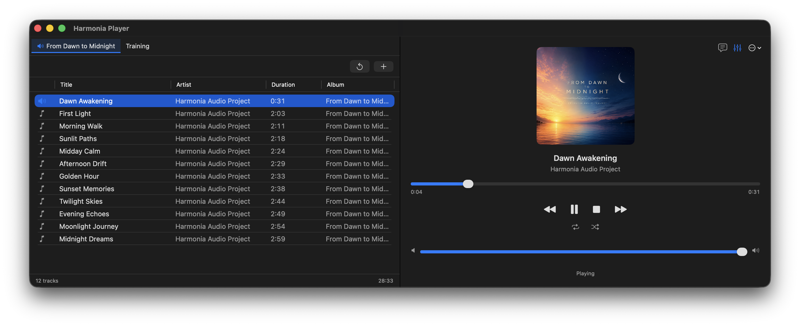
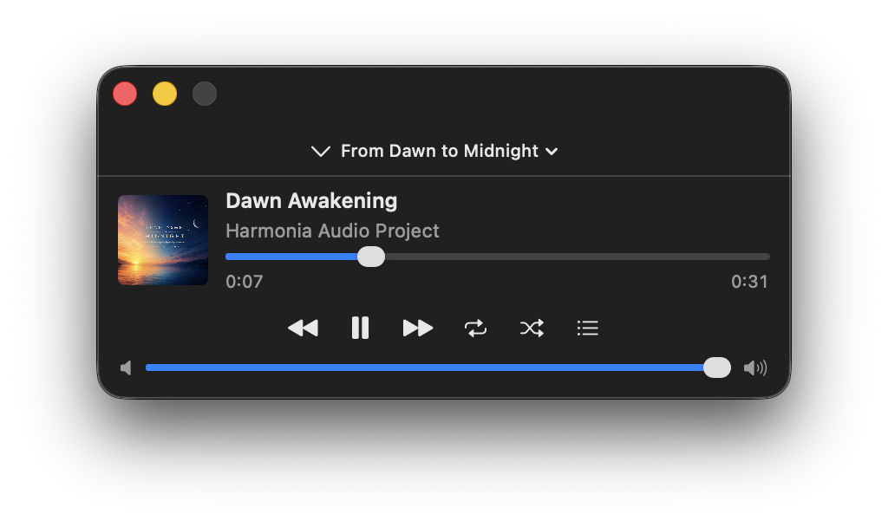
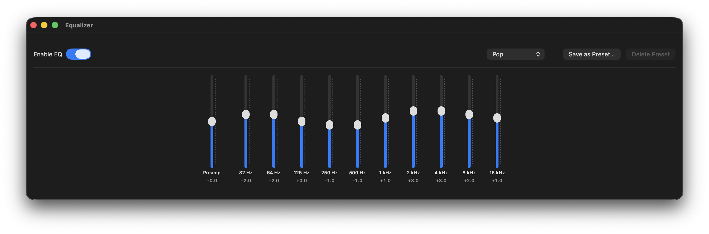
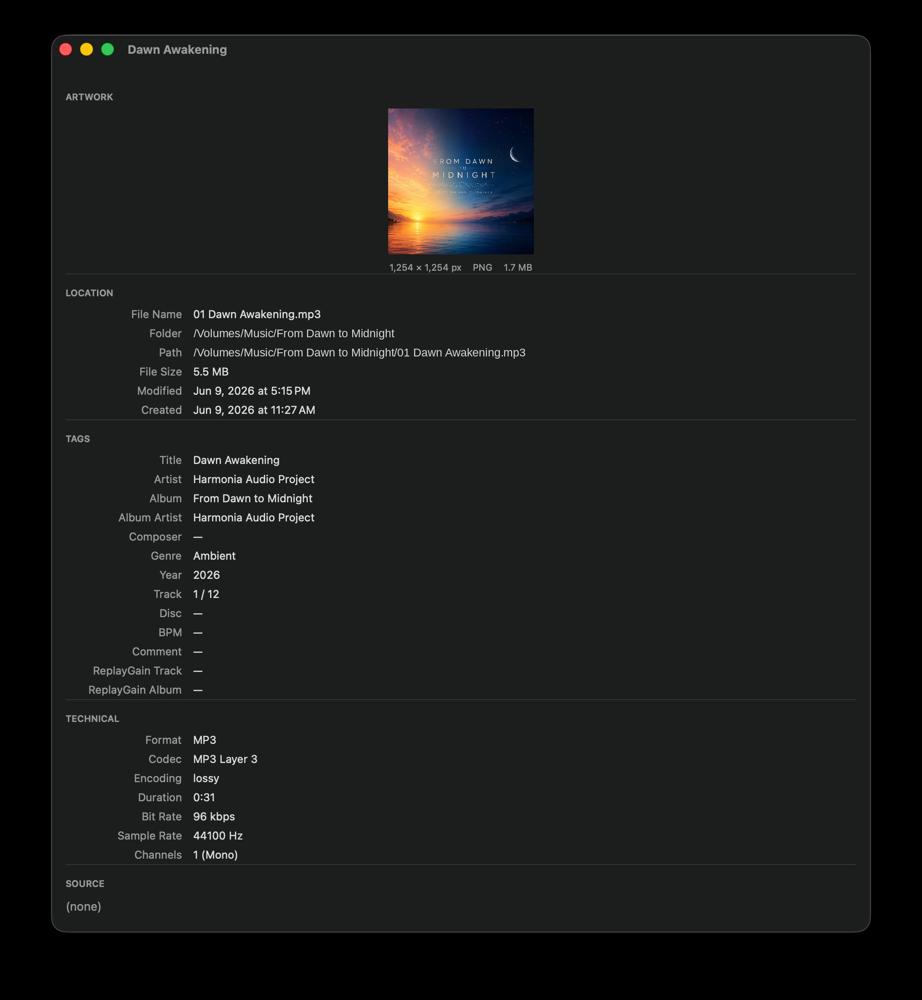

# HarmoniaPlayer

[](https://swift.org)
[](https://developer.apple.com)
[](LICENSE)
[](https://github.com/OneOfWolvesBilly/HarmoniaPlayer/releases)

A native macOS music player for local music libraries, with ReplayGain support and a distraction-free listening experience.

HarmoniaPlayer exists for listeners who keep their own audio files instead of relying on streaming services, and who want a focused, keyboard-friendly player on macOS rather than a media suite.

<p align="center">
  
</p>

## Features

### Free (v1.0.0)

- Playlist-based playback for MP3, AAC, ALAC, WAV, and AIFF
- Multiple playlists with drag-and-drop reordering
- M3U8 import and export
- File and folder drag-and-drop with recursive folder scanning
- Mini Player
- ReplayGain support
- 10-band graphic equalizer with presets
- Shuffle and repeat modes
- File information panel
- Keyboard shortcuts
- macOS menu bar integration
- Persistent playlists and settings
- English, Traditional Chinese, and Japanese localization

### Pro (v2.0.0, planned)

- FLAC playback
- DSD playback
- Tag editor (ID3 / MP4 metadata)
- LRC synchronized lyrics
- Gapless playback

## Screenshots

<p align="center">
  
  
</p>
<p align="center">
  
</p>

## Download

HarmoniaPlayer v1.0.0 (Free) is being prepared for release on the Mac App Store. A download link will appear here once it is live.

The official App Store version will offer optional Pro features through In-App Purchase.

## Build from Source

```bash
git clone https://github.com/OneOfWolvesBilly/HarmoniaPlayer.git
cd HarmoniaPlayer
open App/HarmoniaPlayer/HarmoniaPlayer.xcodeproj
# Select the HarmoniaPlayer scheme, then Product > Run (⌘R)
```

**Requirements:** macOS 15.6+, Xcode 26, Swift 6.

The audio engine is provided by [HarmoniaCore-Swift](https://github.com/OneOfWolvesBilly/HarmoniaCore-Swift), a separate Swift Package. Setup details are in the [Development Guide](docs/development_guide.md).

## Quick Start

1. Launch HarmoniaPlayer.
2. Add tracks with the `+` button or by dragging in files and folders.
3. Double-click a track to play.
4. Use `Space` to play/pause, `⌘→` for next, and `⌘←` for previous.
5. Cycle repeat modes: Off → Repeat All → Repeat One.

See the [User Guide](docs/user_guide.md) for the full walkthrough.

## Technology Stack

HarmoniaPlayer is a Swift 6 and SwiftUI application for macOS. It delivers multi-playlist management with drag-and-drop reordering and M3U8 import/export, ReplayGain volume normalization, state that persists across launches, and full localization in English, Traditional Chinese, and Japanese.

Audio playback and processing are provided by [HarmoniaCore-Swift](https://github.com/OneOfWolvesBilly/HarmoniaCore-Swift), a reusable Swift audio framework designed to back more than one application. HarmoniaPlayer is the primary reference application for HarmoniaCore and demonstrates how the framework can be used to build a complete desktop music player.

Responsibilities are split between the two:

- **HarmoniaPlayer** handles the user interface, playlist management, settings, and App Store integration.
- **HarmoniaCore** handles audio playback, the audio pipeline, and timing.

For the full design, see [docs/architecture.md](docs/architecture.md) and [docs/module_boundary.md](docs/module_boundary.md).

## Open-Core Model

HarmoniaPlayer follows an open-core model. The full application source is public under the MIT License, and building from source yields the Free tier. Optional Pro features are planned for the Mac App Store release.

## Roadmap

- **v1.0.0** — Initial Mac App Store release with the Free feature set.
- **v2.0.0** — Pro tier release with FLAC playback, DSD playback, Tag Editor, synchronized lyrics, and gapless playback.

## Contributing

Contributions are welcome. Please read [CONTRIBUTING.md](CONTRIBUTING.md) before opening a pull request.

## License

MIT License — see [LICENSE](LICENSE).

Copyright (c) 2025–2026 Chih-hao (Billy) Chen

## Contact

- **Email:** [harmonia.audio.project@gmail.com](mailto:harmonia.audio.project@gmail.com)
- **GitHub:** [@OneOfWolvesBilly](https://github.com/OneOfWolvesBilly)
- **Issues:** [Report a bug](https://github.com/OneOfWolvesBilly/HarmoniaPlayer/issues)