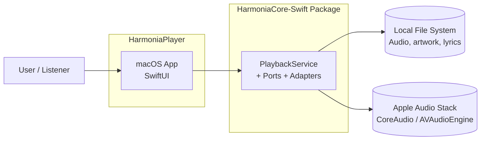
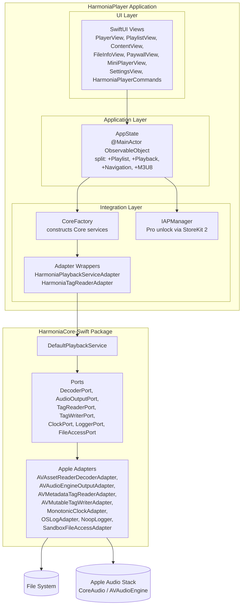

# HarmoniaPlayer Architecture

## 1. System Overview

**HarmoniaPlayer** is a macOS audio player application built on top of **HarmoniaCore-Swift**, a Swift Package that provides the audio engine, metadata reading, and platform adapters.

HarmoniaPlayer has two primary roles:

1. Provide a **practical, user-facing audio player** on macOS.
2. Act as a **reference implementation** demonstrating how to consume HarmoniaCore-Swift APIs in a real application.

The application is intentionally kept modular so that its architecture can be reused if additional platforms (iOS, Linux) are introduced in the future.

---

## 2. Repositories and Components

HarmoniaPlayer is designed to work together with the following repositories:

* **HarmoniaPlayer (this repository)**

  * Contains the macOS application code and documentation.
  * SwiftUI-based UI, application state, integration layer, and tests.

* **HarmoniaCore-Swift**

  * Standalone Swift Package containing the audio engine and platform adapters.
  * Created by tagging a release in HarmoniaCore and using `git subtree split` to extract the `apple-swift/` directory into its own repository, because SPM cannot consume a subdirectory of a repository directly.
  * HarmoniaPlayer pins to a specific tagged version of this package for deployment. During development, a local path reference (`../HarmoniaCore/apple-swift`) is used for rapid iteration.

* **HarmoniaCore**

  * Source-of-truth specification and implementation repository.
  * Contains both the Swift (`apple-swift/`) and C++ (`linux-cpp/`, deferred) implementations side by side.
  * Provides the cross-platform architecture and contracts for:

    * Ports (DecoderPort, AudioOutputPort, TagReaderPort, TagWriterPort, ClockPort, LoggerPort, FileAccessPort)
    * Services (PlaybackService)
    * Models (TagBundle, CoreError, StreamInfo)

**Important:** HarmoniaPlayer never bypasses HarmoniaCore. All audio playback, decoding, metadata reading, and error behavior is delegated to HarmoniaCore-Swift.

**See HarmoniaCore Specs:**
- [Architecture Overview](https://github.com/OneOfWolvesBilly/HarmoniaCore/blob/main/docs/specs/01_architecture.md)
- [Ports Specification](https://github.com/OneOfWolvesBilly/HarmoniaCore/blob/main/docs/specs/03_ports.md)
- [Services Specification](https://github.com/OneOfWolvesBilly/HarmoniaCore/blob/main/docs/specs/04_services.md)
- [Models Specification](https://github.com/OneOfWolvesBilly/HarmoniaCore/blob/main/docs/specs/05_models.md)

---

## 3. Platform Target

### macOS / Swift

* Platform: macOS 15.6+ (Free / Pro variants)
* Technologies:

  * Swift 6, SwiftUI
  * HarmoniaCore-Swift (Swift Package Manager)
  * AVFoundation, CoreAudio
  * StoreKit 2 (macOS Pro IAP)
* Architecture:

  * SwiftUI-based macOS application.
  * Central `AppState` (@MainActor ObservableObject) — no separate ViewModel layer.
  * Views access AppState directly via `@EnvironmentObject`.
  * Integration layer constructs HarmoniaCore-Swift services and wires them into the app (CoreFactory, IAPManager).

Detailed interface contracts:

* [API Reference](api_reference.md)
* [Module Boundaries](module_boundary.md)

---

## 4. High-Level Context (C4 Level 1)

At the highest level, HarmoniaPlayer consumes HarmoniaCore-Swift services and presents them through a native macOS UI.



The **contract** between HarmoniaPlayer and HarmoniaCore is defined entirely in HarmoniaCore specs (ports, services, error behavior). HarmoniaPlayer code is responsible for:

* UI and interaction design.
* Application state and workflows (playlists, views, product variants).
* Platform-specific integration (file pickers, IAP, window lifecycle).

---

## 5. Detailed Architecture (C4 Level 2)



### Layer Responsibilities

**UI Layer (Views):**
- SwiftUI views that render the interface
- **May depend on:** AppState (via `@EnvironmentObject`)
- **Must not depend on:** HarmoniaCore-Swift directly, Ports, Adapters, Services

**Application Layer (AppState):**
- Central observable state (`AppState`, split across 5 files)
- App-layer service protocols (`PlaybackService`, `TagReaderService`) defined here
- Application services (`FileDropService`, `M3U8Service`, `ExtendedAttributeService`)
- **May depend on:** App-layer service protocols, CoreFactory, IAPManager
- **Must not depend on:** HarmoniaCore-Swift, Ports, Adapters, platform-specific APIs

**Integration Layer (CoreFactory, IAPManager, Adapter Wrappers):**
- Constructs HarmoniaCore-Swift services via `HarmoniaCoreProvider`
- Adapter wrappers bridge HarmoniaCore types to app-layer protocols
- `HarmoniaPlaybackServiceAdapter`: maps `CoreError` → `PlaybackError`, sync → async
- `HarmoniaTagReaderAdapter`: maps `TagBundle` → `Track`
- **Only these 3 files may `import HarmoniaCore`:** `HarmoniaCoreProvider.swift`, `HarmoniaPlaybackServiceAdapter.swift`, `HarmoniaTagReaderAdapter.swift`
- **Must not depend on:** SwiftUI, UI state

**HarmoniaCore-Swift Package:**
- **Services:** High-level audio services (`DefaultPlaybackService`)
- **Ports:** Abstract interfaces (protocols) for audio operations
- **Adapters:** Platform-specific implementations of Ports using AVFoundation

See [HarmoniaCore Architecture](https://github.com/OneOfWolvesBilly/HarmoniaCore/blob/main/docs/specs/01_architecture.md) for detailed Port & Adapter pattern.

---

## 6. Key Architectural Patterns

### 6.1 Ports & Adapters (Hexagonal Architecture)

HarmoniaPlayer follows the same Ports & Adapters pattern as HarmoniaCore:

```
┌─────────────────────────────────┐
│   UI Layer (SwiftUI)            │
└──────────────┬──────────────────┘
               │ @EnvironmentObject
┌──────────────▼──────────────────┐
│   Application Layer             │
│   (AppState)                    │
└──────────────┬──────────────────┘
               │ app-layer protocols
┌──────────────▼──────────────────┐
│   Integration Layer             │
│   (CoreFactory, IAPManager,     │
│    Adapter Wrappers)            │
└──────────────┬──────────────────┘
               │ import HarmoniaCore
┌──────────────▼──────────────────┐
│   HarmoniaCore-Swift            │
│   Services → Ports → Adapters   │
└─────────────────────────────────┘
```

**Key Principles:**
1. **UI depends on AppState only** — No direct service access, no ViewModels
2. **AppState uses app-layer service protocols** — `PlaybackService`, `TagReaderService` defined in HarmoniaPlayer
3. **CoreFactory constructs services** — Wires Ports to Adapters via `CoreServiceProviding`
4. **Adapter wrappers at the boundary** — `HarmoniaPlaybackServiceAdapter` maps `CoreError` → `PlaybackError`; `HarmoniaTagReaderAdapter` maps `TagBundle` → `Track`
5. **`import HarmoniaCore` restricted to 3 files** — Everything else uses app-layer abstractions

### 6.2 Dependency Injection

All services are injected via constructors:

```swift
@MainActor
final class AppState: ObservableObject {
    let playbackService: PlaybackService
    let tagReaderService: TagReaderService
    private let iapManager: IAPManager

    init(iapManager: IAPManager, provider: CoreServiceProviding, ...) {
        self.iapManager = iapManager
        let featureFlags = CoreFeatureFlags(iapManager: iapManager)
        let coreFactory = CoreFactory(featureFlags: featureFlags, provider: provider)
        self.playbackService = coreFactory.makePlaybackService()
        self.tagReaderService = coreFactory.makeTagReaderService()
    }
}
```

**Note:** AppState is split across multiple extension files for maintainability:
`AppState.swift` (properties + init), `AppState+Playlist.swift`, `AppState+Playback.swift`,
`AppState+Navigation.swift`, `AppState+M3U8.swift`.

This enables:
- Testing with mocks (`FakeCoreProvider`, `FakePlaybackService`, `MockIAPManager`)
- Runtime configuration (Free vs Pro via `CoreFeatureFlags`)
- Clear dependency graph

### 6.3 Async API

**All PlaybackService methods are async:**
```swift
// PlaybackService protocol (async)
func load(url: URL) async throws
func play() async throws
func pause() async
func stop() async
```

**AppState calls services with async/await:**
```swift
func play() async {
    do {
        try await playbackService.play()
        playbackState = .playing
    } catch {
        let mapped = mapToPlaybackError(error)
        playbackState = .error(mapped)
        lastError = mapped
    }
}
```

**Views dispatch via Task:**
```swift
Button("Play") {
    Task { await appState.play() }
}
```

This separation ensures:
- UI remains responsive
- Core audio operations are predictable
- Error handling is explicit

---

## 7. Design Principles

1. **Ports & Adapters alignment**

   * HarmoniaPlayer does not embed audio logic.
   * All audio responsibilities are forwarded to HarmoniaCore-Swift.

2. **Never break core contracts**

   * HarmoniaPlayer must respect the behavior defined by HarmoniaCore specs.
   * Any audio-related change must be coordinated with HarmoniaCore.

3. **Clear separation of concerns**

   * UI layer (views) is kept separate from application logic and integration layers.
   * Integration layer is the only place that knows how to construct HarmoniaCore services.
   * `import HarmoniaCore` is restricted to 3 Integration Layer files.

4. **No String payloads across module boundary**

   * `CoreError` (with String payloads) is mapped to typed `PlaybackError` codes at the Integration Layer.
   * Technical details stay in HarmoniaCore's logger; UI receives typed error codes only.

5. **Testable and verifiable**

   * All services are injected via protocols and factory pattern.
   * Test doubles: `FakeCoreProvider`, `FakePlaybackService`, `FakeTagReaderService`, `MockIAPManager`.
   * `@MainActor` on test classes using AppState; `nonisolated deinit {}` for Swift 6 compatibility.

---

## 8. Document Map

* **This document** (`docs/architecture.md`)

  * High-level overview of HarmoniaPlayer.
  * Repository relationships and system context.
  * C4 Level 1 and Level 2 diagrams.

* **API Reference**

  * `docs/api_reference.md`
  * Complete public interface: all types, properties, methods, protocols.

* **Module Boundaries**

  * `docs/module_boundary.md`
  * Defines allowed dependencies and module boundaries for the Swift implementation.

* **Implementation Guide (Swift)**

  * `docs/implementation_guide_swift.md`
  * Swift-specific implementation patterns, error handling, IAP, testing.

* **Development Guide**

  * `docs/development_guide.md`
  * Setup instructions, HarmoniaCore integration, cross-repo workflow, coding conventions.

* **Workflow**

  * `docs/workflow.md`
  * SDD → TDD → commit workflow.

* **User Guide**

  * `docs/user_guide.md`
  * End-user documentation for using the app.

* **Documentation Strategy**

  * `docs/documentation_strategy.md`
  * Documentation organization and maintenance policy.

---

## 9. Cross-References to HarmoniaCore

For detailed specifications of the underlying audio framework:

**HarmoniaCore Main Repository:**
- [Architecture Overview](https://github.com/OneOfWolvesBilly/HarmoniaCore/blob/main/docs/specs/01_architecture.md)
- [Adapters Specification](https://github.com/OneOfWolvesBilly/HarmoniaCore/blob/main/docs/specs/02_adapters.md)
- [Ports Specification](https://github.com/OneOfWolvesBilly/HarmoniaCore/blob/main/docs/specs/03_ports.md)
- [Services Specification](https://github.com/OneOfWolvesBilly/HarmoniaCore/blob/main/docs/specs/04_services.md)
- [Models Specification](https://github.com/OneOfWolvesBilly/HarmoniaCore/blob/main/docs/specs/05_models.md)

**HarmoniaCore-Swift Package:**
- [Package README](https://github.com/OneOfWolvesBilly/HarmoniaCore-Swift/blob/main/README.md)
- [Implementation Guides](https://github.com/OneOfWolvesBilly/HarmoniaCore/tree/main/docs/impl)